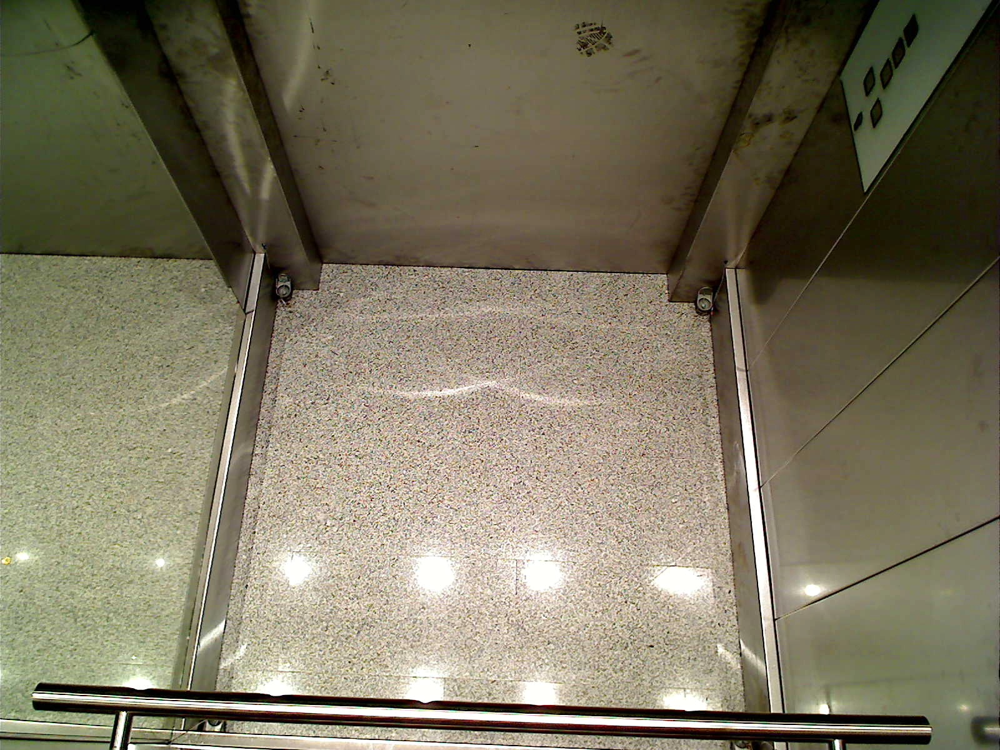
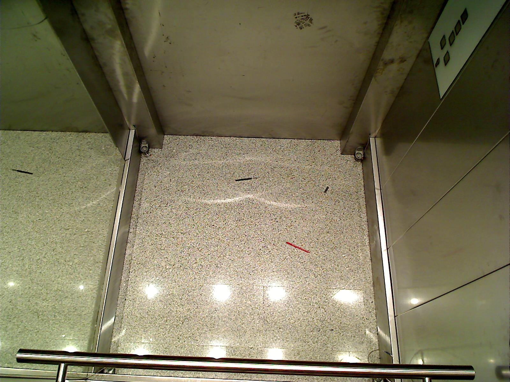
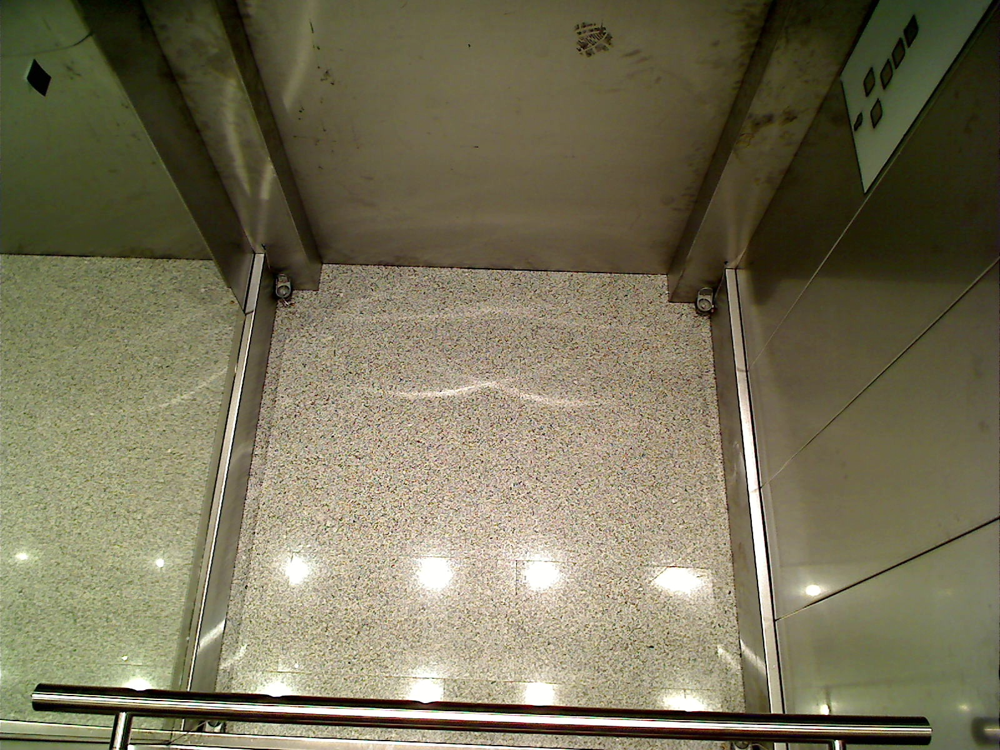
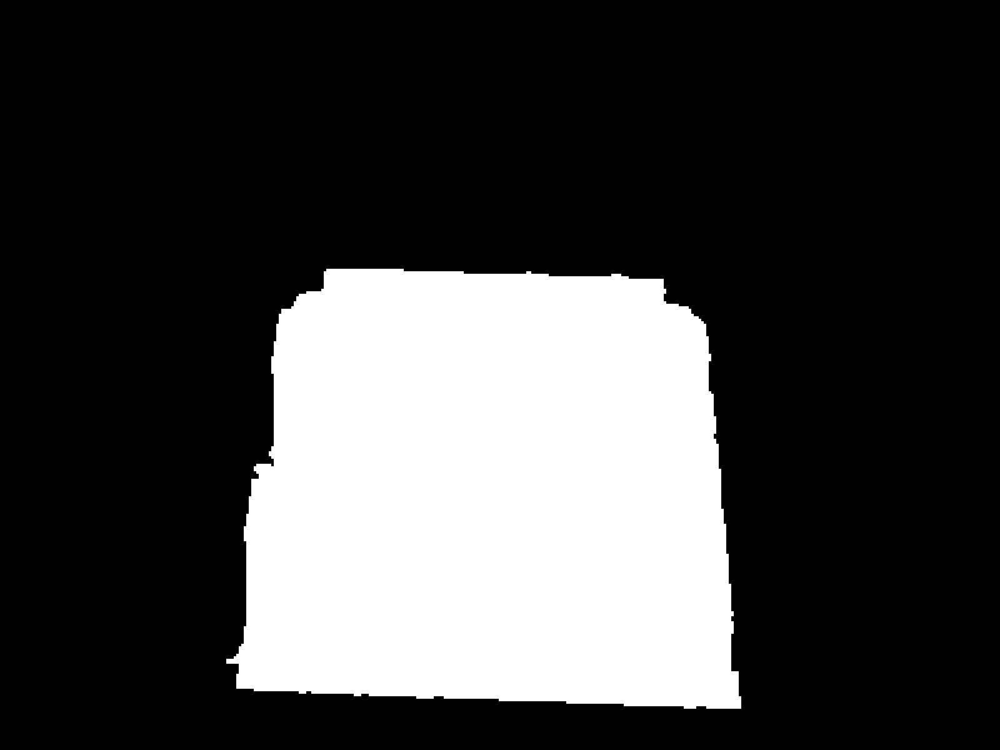
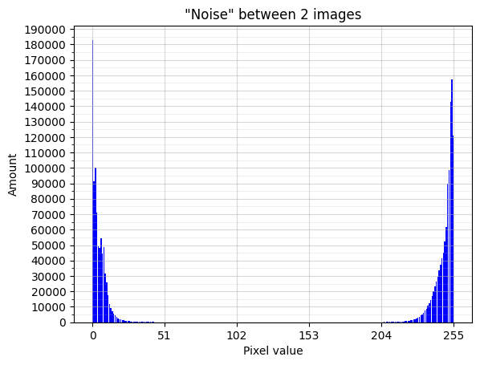
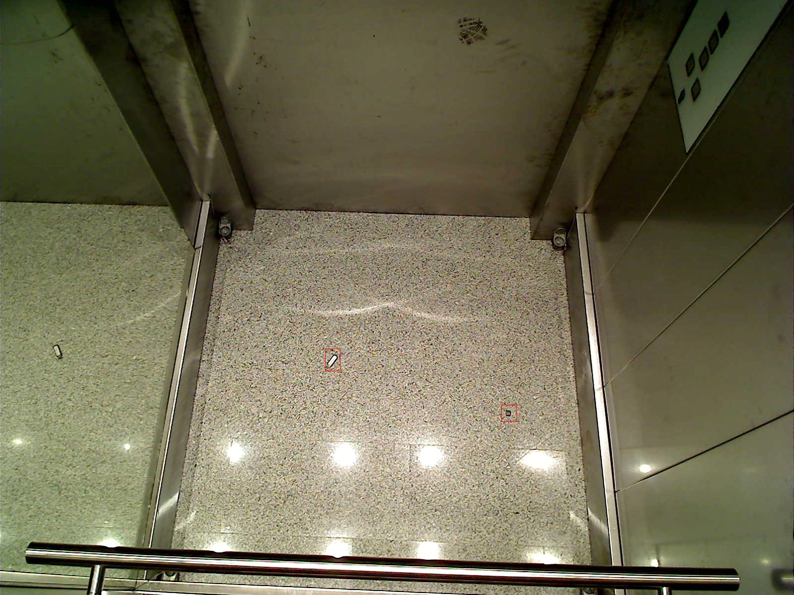

# [EN] Antiterror security project


- [\[EN\] Antiterror security project](#en-antiterror-security-project)
  - [Overview](#overview)
    - [Introduction](#introduction)
    - [Proposed solution ](#proposed-solution-)
    - [Results](#results)
    - [Details](#details)
  - [Install and Run](#install-and-run)
  - [How to Use the Project](#how-to-use-the-project)
  - [Testing](#testing)
  - [Future ideas](#future-ideas)
  - [Credits](#credits)
  - [License](#license)
- [\[RU\] Система антитеррористической безопасности](#ru-система-антитеррористической-безопасности)
  - [Обзор](#обзор)
    - [Введение](#введение)
    - [Предложенное решение](#предложенное-решение)
    - [Результаты](#результаты)
    - [Детали](#детали)
  - [Собрать и запустить проект](#собрать-и-запустить-проект)
  - [Как использовать этот проект](#как-использовать-этот-проект)
  - [Тестирование](#тестирование)
  - [Идеи на будущее](#идеи-на-будущее)
  - [Благодарности](#благодарности)
  - [Лицензия](#лицензия)


## Overview

Greetings! Here I would like to share with you the results of my coursework at Robotics Department of Sirius University. 

### Introduction

The goal was to create and realize a method to detect adandoned items in the elevator's cabin. This's a very important task, because abandoned items can pose a threat to the safety of people.

Let's take a look at the images. We start with an image of an empty elevator car.


The light from the light bulb is actually non-permanent, so the illumination can change.



Also the cabin moves, then the camera, so the image can be shifted from its original position. And it makes the task harder.

You still can't see it here, but these lines, they actually have different lenght and even orientation.


Sometimes there are lost items it the elevator cab, we need to detect them.



Often people put ads on the walls of the elevator. Such things hardly pose a real threat, so we want to ignore their appearnce.



So what solution have I proposed? 

### Proposed solution <a name="proposedsolution"></a>

<!-- omit from toc -->
#### Floor detecion
Firstly, we need to find a working surface - the cabin's floor. To solve this problem, I've used a Canny edge detector with little post-processing. Below you can see the  resulted mask. 



It's definitely not ideal, but it's good enough. Later I want to improve this result, may be another edge detector will show better performance.

You can find the entire source code for solving this problem in the **working_surface** module.

<!-- omit from toc -->
#### Search for forgotten items

Optical flow can't help as to determine the cabin's shift, so
I've formulated the following hypothesis: **the cabin is stable, but every time we make a shot, random noise appearce so the pixels are corrupted now**. 



Noise between two empty images which we saw above, when they are in grayscale format. As you can see, it's definitely not normal, it's more like Beta distribution with both $\alpha$ and $\beta$ = 0.5

If there is a noise, so we can try to get it from the corrupted images, estimate it then try to remove. 
In my hypotesis, using noise estimation and may be a post-processing, we can detect real forgotten items.

Here you can see the table with lower and upper border we have computed according to different parameters of the algorithm. These borders we can you to threshold image, for example, using **thresholdImage** from **noise_borders** module.

<table>
   <tr>
      <td>    </td>
      <td colspan="2">Color images</td>
      <td colspan="2">Gray images</td>
   </tr>
   <tr>
      <td> Strategy </td>
      <td> With histogram equalization </td>
      <td> Without histogram equalization </td>
      <td> With histogram equalization </td>
      <td> Without histogram equalization </td>
   </tr>
   <tr>
      <td> Max </td>
      <td> -701, 650 </td>
      <td> -533, 515 </td>
      <td> -235, 225 </td>
      <td> -175, 179 </td>
   </tr>
   <tr>
      <td> Mean </td>
      <td> -523.875, 425.5 </td>
      <td> -390.875, 308.125 </td>
      <td> -174.5, 147.5 </td>
      <td> -127.875, 106.375 </td>
   </tr>
   <tr>
      <td> Median </td>
      <td> -491.5, 329 </td>
      <td> -381.5, 212 </td>
      <td> -162.5, 112 </td>
      <td> -126, 73 </td>
  </tr>
</table>

On this stage, we have a denoised and thresholded image, then we need to finally detect the lost objects.


You can find the entire source code for solving this problem in the **noise_borders** module.

<!-- omit from toc -->
#### Object detection

We want to find the left objects, that is, circle them in a frame, so the guard can pat attention to them.
Pixels, which locates next to each other, are the pixels of the same object, so we can recursively find this object's borders and circle it.

As a result, we get something like this:



You can find the entire source code for solving this problem in the **detection** module.

### Results

Using this pipeline with different parameters, like, use histogram equalization or not, use grayscale or BGR format and etc, you cant achieve the following result: 


<table>
   <tr>
      <td>  </td>
      <td colspan="3"> Validation </td>
      <td colspan="2"> Test </td>
   </tr>
   <tr>
      <td> Straregy, parameters and postprocessing </td>
      <td> Precision </td>
      <td> Recall </td>
      <td> F<sub>2</sub></td>
      <td> Precision </td>
      <td> Recall </td>
   </tr>
   <tr>
      <td> Mean, Color, without eq.; M<sub>3</sub>x4, D<sub>7</sub>x3</td>
      <td> 0.741 </td>
      <td> 0.855 </td>
      <td> <b>0.830</b> </td>
      <td> <b>1.000</b> </td>
      <td> <b>1.000</b> </td>
   </tr>
   <tr>
      <td> Mean, Color, with eq.; M<sub>3</sub>x5, D<sub>7</sub>x3</td>
      <td> <b>0.856</b> </td>
      <td> 0.710 </td>
      <td> 0.735 </td>
      <td> <b>1.000</b> </td>
      <td> 0.727 </td>
   </tr>
   <tr>
      <td> Median, Color, without eq.; M<sub>3</sub>x4, D<sub>7</sub>x3</td>
      <td> 0.369 </td>
      <td> <b>0.949</b> </td>
      <td> 0.722 </td>
      <td> <b>1.000</b> </td>
      <td> <b>1.000</b> </td>
   </tr>
</table>

As you can see, we've achieved the following results:
second algo can detect around 70% of all lost items, but it'll generate on 1 extra frame for every 6 correct ones.
Third variant will detect around 95% of all lost items, which is very good, but it'll also generate 2 extra frames for every one correct. 
First implementation just have the best ratio between precision and recall.

(Here M<sub>x</sub> is a shortcut for MaxNeighbour filter,
D<sub>x</sub> is a shortcut for Dilate filter)

### Details

In the case you want to know more about the details or you want to read about this problem in more scientific way, you can read my [report](./report.pdf) in Russian. 

## Install and Run

To run install and run this peoject, you can follow these steps:

1. Make sure that you already have installed cmake>=3.10, cause this project is cmake-based, and git to clone this repository. Also you need an opencv c++ library installed. Google tests will be needed for testing, if for some reasons you dont have this library, you will need to edit the file called ./CMakeLists.txt
2. Clone this project using the following command:
   ```bash
    git clone git@github.com:windowsartes/AntiterrorSecurityProject.git
    cd AntiterrorSecurityProject/
   ```
   So you are in the project root directory now.
3. To build the project, there are 2 options:
   1. If you have a make installed into your system (or its equivalent):
      ```bash
        mkdir build
        cd build
        cmake ..
        make
        ```
    2. In the case you don't have a make (or its equivalent):
       ```bash
       mkdir build
       cd build
       cmake ..
       cmkae --build .
       ```
4. The project have built so you can use the cli now:
5. 
   (You are still in the ./build directory)

    ```bash
    ./antiterror_security <path_to_your_image> [-s] [path_to_dir]
    ```

   Be sure to pass as the first argument the path to the file (absolute or relative to the ./build directory) where you want to find leftover items.
   The result can be saved in a directory of your choice, to do this, pass the "-s" flag as the second argument, followed by the path to this directory.

   Note that it works fine for my dataset, in your case may be you will be needed to compute a new bounds for noise using "noise_dorders" module and new mask for working surface with "working_surface" module

## How to Use the Project

In the case you want to use this project for your data out of box, there will be some trouble cause:

    1. Working surface mask will be incorrect, so you need to re-compute it;
    2. Boundaries for noise will be incorrect too, so re-compute them;

Because of this to point, I'll describe source code modules so you can use them proper. 
  
   * detection - contains the code for object visual detection; use it with already thresholded image;
   * filters - contains some useful filters, they are commonly used inside other functions; 
   * noise_borders - contains some functions for computing the noise lower and upper borders; all the preprocessing takes place inside its core function, so you can use it out of box;
   * preprocessing - use it to prepare you data; commonly used inside other functions;
   * utils - contains some useful functions;
   * working_surface - use it for working surface searching; its core function, findSurface, can be used out of box, In other words, without any preprocessing;

For more details, read module's readme and function's dockstrings.

## Testing

You must be in the ./build directory, because the paths to the test data are written relative to this directory.
To run all tests, you can use this command.

```bash
./tests/tests
```

If you want to run tests for specific function, you can ues this command 

```bash
./tests/tests --gtest_filter="functionName.*"
```

For example, if you want to test **quickSelectMedian** function, use 

```bash
./tests/tests --gtest_filter=quickSelectMedian.*
```

## Future ideas

In the future, I would also like to implement the following ideas for this project:

* Mark up the data, so I can compute metrics automatically. Now I have to do it by my hands T_T;
* Compare my algorithm with others. For example, with Hoare's algorithm for object detection;
* Tune Github actions;
* Improve the working sufrace detection algo;

## Credits

Thanks to my academic advisor, Andrei V. Shipatov, for the opportunity to try my hand at such an interesting project.

## License

I use the MIT [License](./LICENSE.md)
 here, so feel free to copy and modify this code.

# [RU] Система антитеррористической безопасности

## Обзор

Приветствую! Здесь я хотел бы поделиться с вами результатами моей курсовой работы, которую я выполнял как студент образовательной программы «Математическая робототехника и искусственный интеллект» университета «Сириус».

### Введение

Моей задачей было придумать и реализовать алгоритм детекции оставленных в кабине лифта вещей. Это действительно значимая проблема, потому что оставленные вещи могут нести угрозу жизни и здоровью людей.

Давайте взглянем на снимки кабины, чтобы понять, с чем придётся иметь дело. 
Мы начинаем со снимка пустой кабины лифта.


Освещённость кабины может меняться в процессе её движения.


Помимо этого, кабина движется, что приводит в движение и камеру - она начинает шататься. Поэтому изображение также сдвигается относительно своего изначального положения, что делает задачу несколько труднее.

Здесь это едва ли заметно, но у этих линий различная длина. Более того, у них чуть-чуть отличается и ориентация.


Иногда в кабине остаются какие-то вещи, их-то нам и нужно уметь находить.


Часто люди клеят на стенки лифта объявления, стикеры и т.д. Едва ли эти вещи несут в себе какую-то угрозу, поэтому их мы хотим игнорировать.


Так какое же решение я предложил? 

### Предложенное решение

<!-- omit from toc -->
#### Обнаружение пола

В первую очередь необходимо найти рабочую поверхность кабины - ей пол. Для решения этой задачи я использовал детектор границ Кэнни и лёгкую постобработку. Ниже вы можете наблюдать результат работы этого алгоритма:


Да, маска получилась далеко не идеальной. В дальнейшем я хотел бы улучшить её, возможно, другой алгоритм обнаружения границ справится с этой задачей получше.

Весь исходный код для решения этой задачи вы можете найти в модуле **working_surface**.

<!-- omit from toc -->
#### Поиск оставленных вещей.

С помощью оптического потока сдвиг кабины мы компенсировать не сможем, поэтому я сформулировал следующую рабочую гипотезу: **кабина в действительности устойчива, но каждый раз, когда мы делаем снимок, к изображению добавляется некий случайный шум, который портит картинку.**


Шум мужду двумя пустуми изображениями, которые мы видели выше, когда они представлены в чёрно-белом варианте. Как можно заметить, шум распределён совсем не нормально, скорее, это Бета-распределение с параметрами $\alpha$ and $\beta$ = 0.5

Если мы имеем дело с шумом, то может попробовать извлечь его из зашумлённых изображений и оценить. В рамках моей гипотезы оценка шума с его последующим удалением, и, возможно, постобработка результата позволят нам выделить инородные объекты на изображении.

Ниже вы можете видеть таблицу с нижними и верхними оценками на шум, которые я посчитал для различных параметров алгоритма. С помощью этих оценок мы можем отфильтровать шум, например, используя функцию **thresholdImage** из модуля **noise_borders**.

<table>
   <tr>
      <td>    </td>
      <td colspan="2">Цветное изображение</td>
      <td colspan="2">Чёрно-белое изображение</td>
   </tr>
   <tr>
      <td> Стратегия оценивания шума </td>
      <td> С выравниванием гистограммы </td>
      <td> Без выравнивания гистограммы </td>
      <td> С выравниванием гистограммы </td>
      <td> Без выравнивания гистограммы </td>
   </tr>
   <tr>
      <td> Max </td>
      <td> -701, 650 </td>
      <td> -533, 515 </td>
      <td> -235, 225 </td>
      <td> -175, 179 </td>
   </tr>
   <tr>
      <td> Mean </td>
      <td> -523.875, 425.5 </td>
      <td> -390.875, 308.125 </td>
      <td> -174.5, 147.5 </td>
      <td> -127.875, 106.375 </td>
   </tr>
   <tr>
      <td> Median </td>
      <td> -491.5, 329 </td>
      <td> -381.5, 212 </td>
      <td> -162.5, 112 </td>
      <td> -126, 73 </td>
  </tr>
</table>

На данном этапе, у нас есть изображение, которые мы избавили от шума, и затем с помощью некой границы разделили пиксели в две группы - пиксели рабочей зоны и пиксели оставленных в кабине предметов.

Весь исходный код для решения этой задачи вы можете найти в модуле **noise_borders**.

<!-- omit from toc -->
#### Детектирование объектов

Теперь мы хотим детектировать оставленные в кабине предметы, то есть, обвести их в рамку. Например, чтобы охранник обратил на них внимание. Пиксели, расположенные рядом друг с другом, это пиксели одного и того же объекта, значит, найдя один такой пиксель, мы можем рекурсивно очертить границы объекта.

В результате, получаем что-то такое:


Весь исходный код для решения этой задачи вы можете найти в модуле **detection**.

### Результаты 

В рамках предлагаемой выше схемы есть несколько параметров алгоритма: использовать ли выравнивание гистограммы изображения или нет, работь ли с цветным или чёрно-белым снимком. Используя различные комбинации этих параметров, можно получить следующие результаты:

<table>
   <tr>
      <td>  </td>
      <td colspan="3"> Validation </td>
      <td colspan="2"> Test </td>
   </tr>
   <tr>
      <td> Стратегия оценки шума, параметры алгоритма и постобработка </td>
      <td> Precision </td>
      <td> Recall </td>
      <td> F<sub>2</sub></td>
      <td> Precision </td>
      <td> Recall </td>
   </tr>
   <tr>
      <td> Mean, Цветное, без выр.; M<sub>3</sub>x4, D<sub>7</sub>x3</td>
      <td> 0.741 </td>
      <td> 0.855 </td>
      <td> <b>0.830</b> </td>
      <td> <b>1.000</b> </td>
      <td> <b>1.000</b> </td>
   </tr>
   <tr>
      <td> Mean, Цветное, с выр.; M<sub>3</sub>x5, D<sub>7</sub>x3</td>
      <td> <b>0.856</b> </td>
      <td> 0.710 </td>
      <td> 0.735 </td>
      <td> <b>1.000</b> </td>
      <td> 0.727 </td>
   </tr>
   <tr>
      <td> Median, Цветное, без выр.; M<sub>3</sub>x4, D<sub>7</sub>x3</td>
      <td> 0.369 </td>
      <td> <b>0.949</b> </td>
      <td> 0.722 </td>
      <td> <b>1.000</b> </td>
      <td> <b>1.000</b> </td>
   </tr>
</table>

Как вы можете видеть, мы достигли следующих результатов:
второй алгоритм может обнаружить около 70% от всех оставленных в лифте вещей, зато на каждые 6 верно сгенерированных рамок будет всего 1 лишняя. Третий вариант алгоритма будет верно находить уже 95% от всех вещей, но из 3 сгенерированных рамок 2 будут некорректные. Первый вариант алгоритма просто обладает наилучшим соотношением precision и recall.

(M<sub>x</sub> - это сокращение для MaxNeighbour фильтра,
D<sub>x</sub> - сокращение для фильтра Dilate)

### Детали

Если же вы хотите в деталях знать, что и как я делал, или хотите почитать текст в более научном стиле, обратите внимание на мой [отчёт](./report.pdf) о проделанной работе.

## Собрать и запустить проект

Чтобы собрать и запустить этот проект, вы можете следовать этим шагам:

1. Убедитесь, что вы установили cmake>=3.10, потому что этот проект cmake-based, и git, чтобы склонировать этот репозиторий. Также понадобится плюсовая библиотека opencv. Гугл-тесты будут необходимы для тестирования кода, если же у вас нет этой библиотеки, вам нужно будет отредактировать файл под названием ./CMakeLists.txt
2. Склонируйте этот репозиторий с помощью следующей команды:
   ```bash
    git clone git@github.com:windowsartes/AntiterrorSecurityProject.git
    cd AntiterrorSecurityProject/
   ```
   Теперь вы находитесь в корневой директории проекта.
3. Есть 2 варианта, чтобы собрать этот проект:
   1. Если в вашей системе установлен make (или его аналог):
      ```bash
        mkdir build
        cd build
        cmake ..
        make
        ```
    2. В случае, если make (или его аналога) у вас нет:
       ```bash
       mkdir build
       cd build
       cmake ..
       cmkae --build .
       ```
4. Проект собран, теперь можно использовать cli:
   
   (Вы всё ещё в директории ./build)
    ```bash
    ./antiterror_security <path_to_your_image> [-s] [path_to_dir]
    ```
   Обязательно нужно первым аргументом передать путь до файла (абсолютный или записаный относительно директории ./build), на котором вы хотите найти оставленные предметы.
   Результат можно сохранить в вами выбранной директории, для этого передайте флаг "-s" вторым аргументом и за ним путь до этой директории.

   Заметьте, что моё решение хорошо работает с моими данными, в вашем случае может понадобиться пересчитать оценки на шум и заново найти маску для веделения рабочей зоны.

## Как использовать этот проект

В случае, если вы хотите использовать этот проект для своих данных из коробки, возникнут некоторые проблемы:

   1. Маска рабочей поверхности будет некорректной, поэтому ее необходимо вычислить заново;
   2. Границы для шума тоже будут неверными, так что пересчитайте их;

Поэтому, я чуть-чуть опишу каждый из модулей исходного кода, чтобы вы могли использовать их по назначению:

* **detection** - содержит код для визуального обнаружения объектов; используйте его с изображениями, чьи пиксели уже разделены на пиксели поверхности и пиксели объектов;
* **filters** - содержит несколько полезных фильтров, которые используются во время постобработки;
* **noise_borders** - содержит некоторые функции для вычисления нижней и верхней границ шума; вся предварительная обработка происходит внутри его основной функции, так что вы можете использовать её из коробки;
* **preprocessing** - используйте его для подготовки ваших данных; обычно его функционал используется внутри других функций или cli;
* **utils** - содержит несколько полезных функций;
* **working_surface** - используйте его, чтобы найти рабочую поверхность; его основная функция, **findSurface**, может использоваться из коробки. Другими словами, без какой-либо предварительной обработки;

Чтобы получить более детальное описание, читайте личное README каждого из модулей и докстринги функций.

## Тестирование

Вы должны находится в директории ./build, потому что пути до тестовых данных прописаны относительно этой директории.
Чтобы запустить все тесты, используйте следующую команду:

```bash
./tests/tests
```

Если вы хотети протестировать только какую-то отдельную функцию, используйте следующую команду:

```bash
./tests/tests --gtest_filter="имяФункции.*"
```

Например, чтобы протестировать функцию **quickSelectMedian**, используйте  

```bash
./tests/tests --gtest_filter=quickSelectMedian.*
```

## Идеи на будущее

В будущем, работая над этим проектом, я хотел бы реализовать следующие идеи:

* Разметить данные, чтобы я смог считать метрики автоматически. Сейчас я вынужден делать это руками T_T;
* Сравнить мой алгоритм с известными аналогами. Например, с кфскадным алгоритмом Хоара;
* Настроить Github actions;
* Улучшить алгоритм нахождение рабочей поверхности;

## Благодарности 

Спасибо моему научному руководителю, Шипатову Андрею Владимировичу, за возможность попробовать свои силы в таком интересном проекте.

## Лицензия

Я использую [лицензию](./LICENSE.md) MIT, поэтому не стесняйтесь копировать и изменять этот код.