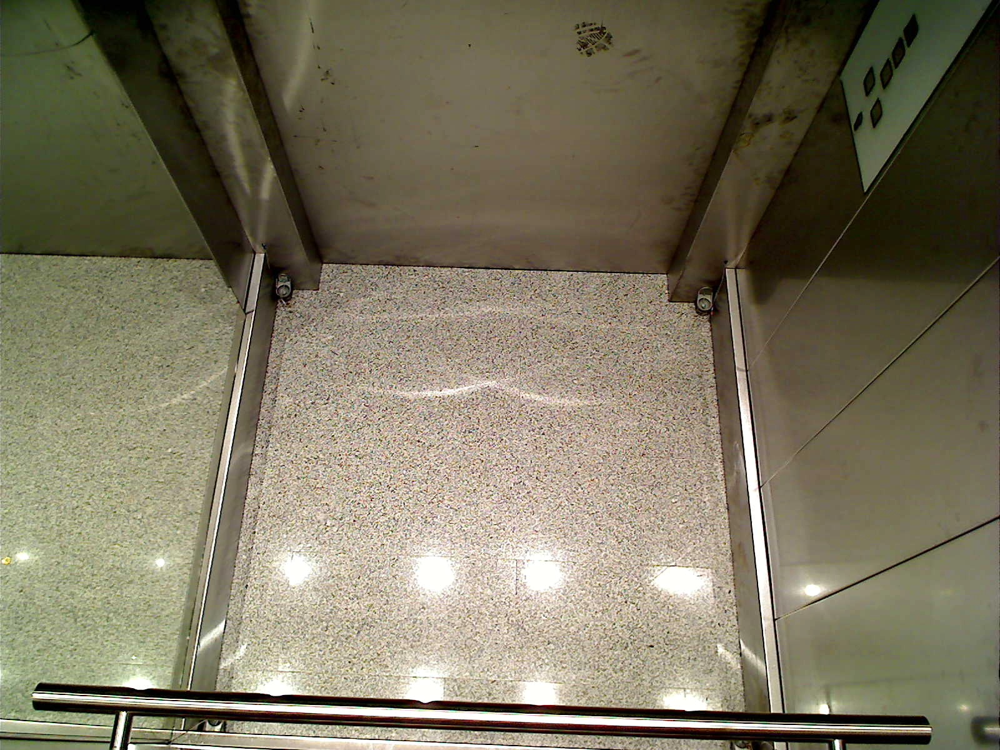
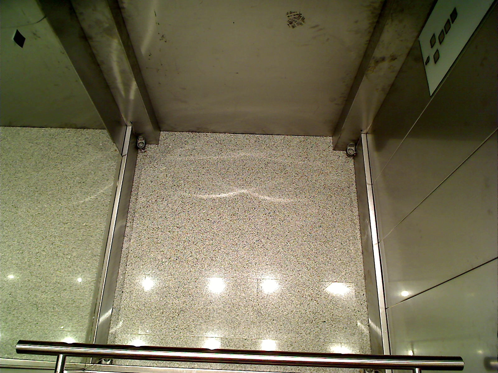
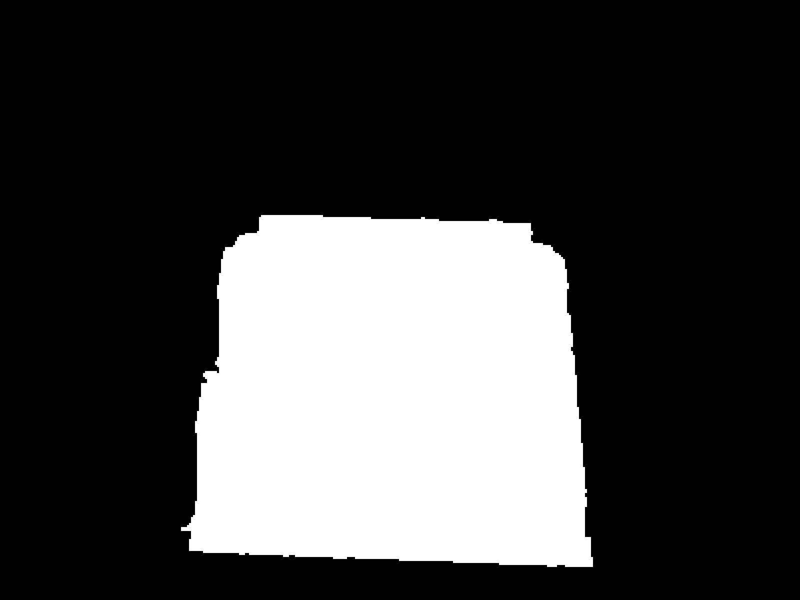

# [EN] Anti-terror security project


- [\[EN\] Anti-terror security project](#en-anti-terror-security-project)
  - [Overview](#overview)
    - [Introduction](#introduction)
    - [Proposed solution ](#proposed-solution-)
    - [Results](#results)
    - [Details](#details)
  - [Install and Run](#install-and-run)
  - [How to Use the Project](#how-to-use-the-project)
  - [Credits](#credits)
  - [License](#license)


## Overview

Greetings! Here I would like to share with you the results of my coursework at Robotics Department of Sirius University. 

### Introduction

The goal was to create and realize a method to detect adandoned items in the elevator's cabin. This's a very important task, because abandoned items can pose a threat to the safety of people.

Let's take a look at the images. We start with an image of an empty elevator car.


The light from the light bulb is actually non-permanent, so the illumination can change.



Also the cabin moves, then the camera, so the image can be shifted from its original position. And this makes the task harder.

--here will be an image with optical flow--

Sometimes there are lost items it the elevator cab, we need to detect them.


Often people put ads on the walls of the elevator. Such things hardly pose a real threat, so we want to ignore their appearnce.



So what solution have I proposed? 

### Proposed solution <a name="proposedsolution"></a>

<!-- omit from toc -->
#### Floor detecion
Firstly, we need to find a working surface - the cabin's floor. To solve this problem, I've used a Canny edge detector with little post-processing. Below you can see the  resulted mask. 



It's definitely not ideal, but it's good enough. Later I want to improve this result, may be another edge detector will show better performance.

You can find the entire source code for solving this problem in the "working_surface" module.

<!-- omit from toc -->
#### Search for forgotten items

Optical flow can't help as to determine the cabin's shift, so
I've formulated the following hypothesis: **the cabin is stable, but every time we make a shot, random noise appearce so the pixels are corrupted now**. 

--here can be a hystogram with the noise value--

If there is a noise, so we can try to get it from the corrupted images, estimate it then try to remove. 
In my hypotesis, using noise estimation and may be a post-processing, we can detect real forgotten items.

--As fast as I write a formal work report, the will be a table with result and the explanation--

On this stage, we have a denoised and thresholded image, then we need to finally detect the lost objects.


You can find the entire source code for solving this problem in the "noise_borders" module.

<!-- omit from toc -->
#### Object detection

We want to find the left objects, that is, circle them in a frame, so the guard can pat attention to them.
Pixels, which locates next to each other, are the pixels of the same object, so we can recursively find this object's borders and circle it.

--Here will be an image with detected objects--

You can find the entire source code for solving this problem in the "detection" module.

### Results

Using this pipeline with different parameters, like, use histogram equalization or not, use grayscale or BGR format and etc, you cant achieve the following result: 

--Here will be the table with metrics and metrics explanation--

### Details

In the case you want to know more about the details or you want to read about this problem in more scientific way, you can read my paper. --Here will be a hyperlink, when the report will be done-- 

## Install and Run

To run install and run this peoject, you can follow these steps:

1. Make sure that you already have installed cmake>=3.10, cause this project is cmake-based, and git to clone this repository. Also you need an opencv c++ library installed. Google tests will be needed for testing, if for some reasons you dont have this library, you will need to edit the file called ./CMakeLists.txt
2. Clone this project using the following command:
   ```bash
    git clone git@github.com:windowsartes/AntiterrorSecurityProject.git
    cd antiterror_security_project/
   ```
   So you are in the project root directory now.
3. To build the project, there are 2 options:
   1. If you have a make installed into your system (or its equivalent):
      ```bash
        mkdir build
        cd build
        cmake ..
        make
        ```
    2. In the case you don't have a make (or its equivalent):
       ```bash
       mkdir build
       cd build
       cmake ..
       cmkae --build .
       ```
4. The project have built so you can use the cli now:
   (You are still in the ./build directory)
    ```bash
    ./antiterror_security --here will be a cli interface--
    ```
    Note that it works fine for my dataset, in your case may be you will be needed to compute a new bounds for noise using noise_dorders module.

## How to Use the Project

In the case you want to use this project for your data out of box, there will be some trouble cause:

    1. Working surface mask will be incorrect, so you need to re-compute it;
    2. Boundaries for noise will be incorrect too, so re-compute them;

Because of this to point, I'll describe source code modules so you can use them proper. 
  
   * detection - contains the code for object visual detection; use it with already thresholded image;
   * filters - contains some useful filters, they are commonly used inside other functions; 
   * noise_borders - contains some function for computing the noise lower and upper borders; all the preprocessing takes place inside its core function, so you can use it out of box;
   * preprocessing - use it to prepare you data; commonly used inside other function;
   * utils - contains some useful function;
   * working_surface - use it for working surface searching; its core function, findSurface, can be used out of box, In other words, without any preprocessing;

For more details, read module's readme and function's dockstrings.

## Credits

Thanks to my academic advisor, Andrei V. Shipatov, for the opportunitu to try my hand at such an interesting project.

## License

I use the MIT License here, so feel free to copy and modify this code.